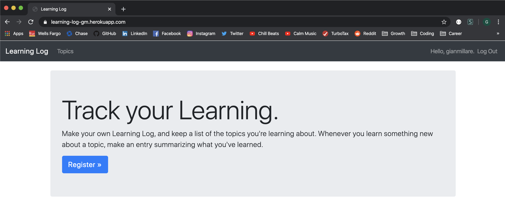
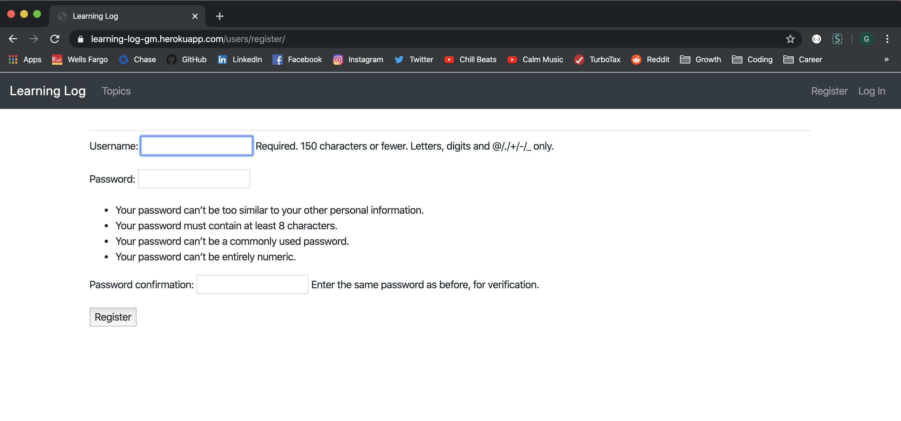
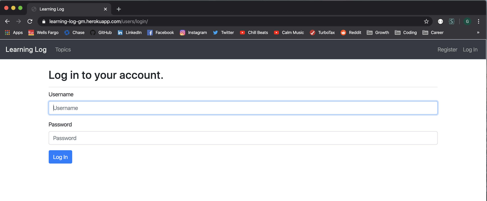
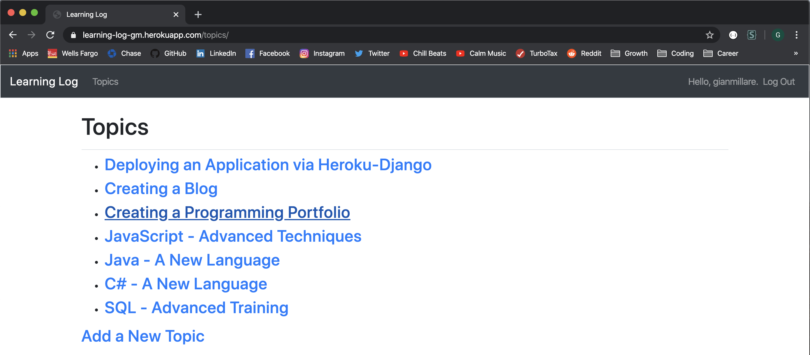

# Learning-Log {Django Application}
https://learning-log-gm.herokuapp.com/
-----------------------------------------------------------------------------------------------------------------------

This Django-centered project is from Eric Matthes project-based programming book titled "Python Crash Course", and will be crucial to my career as a software developer. Up until now, I've had the capabilities to perform data analysis and create small applications, but haven't had a platform to display them (except GitHub of course). This project is the perfect gateway to learn how to build web applications to host my projects.

I've had some experience with Django and application building. However, not to the extent where I can truly call myself proficient with the Django Python Library. This project's sole purpose is to (hopefully) increase my skill level with Django and Python programming from Intermediate to Advance.

-----------------------------------------------------------------------------------------------------------------------

### Below is an image of what I set out to accomplish: a journal-like application that can log topics and entries.

This application is blog-styled. Meaning, people can constantly update things that they've learned by logging (or blogging) their topics and entries based on what they learned. This is a perfect way to (1) keep tabs on lessons, and (2) write down any key pieces of information (like lines of code or formulas).

-----------------------------------------------------------------------------------------------------------------------

### The home page of the application is an introduction to what the application is primarily used for. New users will be greeted with a Jumbotron and will have an option to register an account.

-----------------------------------------------------------------------------------------------------------------------

### Users that already have an account will be prompted to Login before accessing any topics or entries.

-----------------------------------------------------------------------------------------------------------------------

### Once a User logs into their account, they'll be able to access the 'Topics' page where they can create new topics, and create etnires for those topics. 

Each entry is timestamped, and listed in reverse chronological order. Users will also be able to edit these entries.

-----------------------------------------------------------------------------------------------------------------------

### Below is a snapshot of the code used in the project. The application is almost entirely made from Python (Django) and JavaScript.

