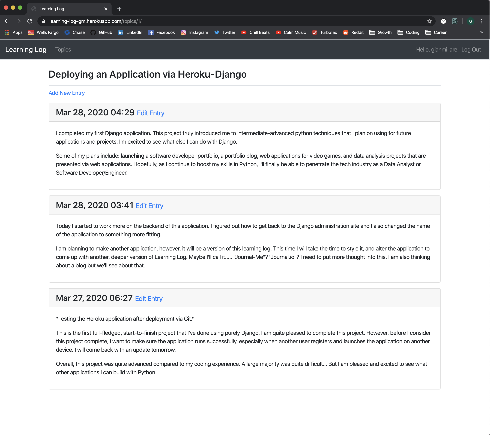

# Learning-Log (in progress)
Creating a learning log application using Django

https://learning-log-gm.herokuapp.com/
-----------------------------------------------------------------------------------------------------------------------

This project is from Eric Matthes project-based programming book titled "Python Crash Course", and will be crucial to my career as a software developer. 

I've had some experience with Django and application building. However, not to the extent where I can truly call myself proficient with the Django Python Library. This project's sole purpose is to (hopefully) increase my skill level with Django and python Programming from Intermediate to Advance.

-----------------------------------------------------------------------------------------------------------------------

